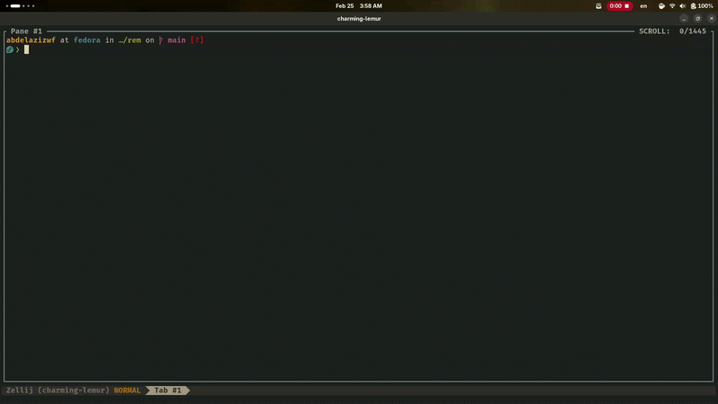

# rem

Basic Linux reminder notifications using `notify-send` and `at`.

```bash
$ rem

Usage: rem <time|time-delta> <message>
  <time>: military time (ex. 14:20, 05:00).
  <time-delta>: add N minutes to current time (ex. +30, +135).
  <message>: message to be displayed (ex. "Feed the cats").
```

## Installation

```bash
$ git clone https://github.com/abdelazizwf/rem
$ cd rem
$ chmod 755 rem
$ sudo cp rem /usr/local/bin/
```

## Demo


